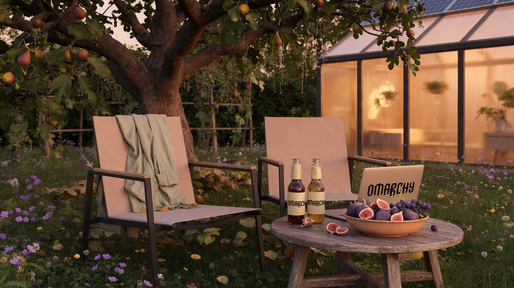

# Luke's Omarchy Themes


Themes for [Omarchy](https://omarchy.org/) Quattro. One folder per theme. Install any of them with:

```bash
git clone https://github.com/lukejmorrison/lukesomarchythemes.git
cd lukesomarchythemes
./install-theme.sh <theme-slug>
```

That symlinks the folder into `~/.config/omarchy/themes/` and runs `omarchy theme set`.

## Index

| Theme | Slug | Notes |
|---|---|---|
| [Kingdom Age](#kingdom-age) | `kingdom-age` | Fig tree, lawn chairs, honey-gold, Matrix verses |
| | | _Drop the next theme in a new folder and add a row here_ |

---

## Kingdom Age

Every household on its own land, under its own vine and fig tree. Golden-hour gardens, quiet solar glass, a lawn chair, and a cold beer. [Full notes →](kingdom-age/)

```bash
./install-theme.sh kingdom-age
```


<table>
<tr>
<td></td>
<td></td>
</tr>
<tr>
<td></td>
<td></td>
</tr>
</table>

Soil `#17140f` · linen `#ead9c4` · honey `#d4a054` · fig leaf `#6f9a4a`

---

## Add another theme

1. Copy the shape of `kingdom-age/` into a new folder named with a slug (`my-theme`).
2. Required: `colors.toml`, `backgrounds/`, `preview.jpg`.
3. Nice to have: `unlock.png`, `preview-unlock.png`, `icons.theme`, a short `README.md`.
4. Add a row to the index table and a section above this one, with the preview and two or three sample wallpapers.
5. Install locally with `./install-theme.sh my-theme`.

```
my-theme/
  README.md
  colors.toml
  icons.theme
  preview.jpg
  unlock.png
  backgrounds/
    1-something.jpg
```

Omarchy `theme install` clones a **whole repo** as one theme, so this collection is cloned once and installed per folder. Do not put `colors.toml` at the collection root.
