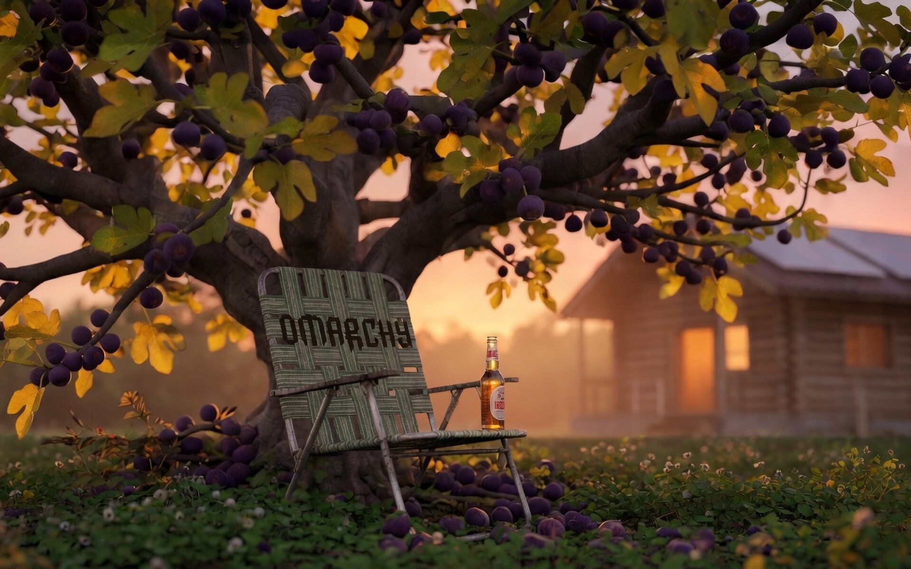

# Kingdom Age

An [Omarchy](https://omarchy.org/) Quattro theme of the biblical Kingdom Age: every household on its own land, under its own vine and fig tree. Golden-hour gardens, quiet solar glass, lawn chairs, and a cold beer. Homemade bottles and the closed laptop wear the Omarchy wordmark.

Micah 4:4 · 1 Kings 4:25 · Zechariah 3:10 · John 1:48–49 · Isaiah 2:4 · Isaiah 65 · Revelation 21–22

Wallpapers generated with Grok Imagine.





## Palette

| Role | Hex | From |
|---|---|---|
| Background | `#17140f` | garden soil at dusk |
| Text | `#ead9c4` | linen |
| Accent | `#d4a054` | honey / beer / lamp |
| Green | `#6f9a4a` | fig leaf |
| Red | `#c45c48` | pomegranate |
| Cyan | `#6aaba0` | river of life |

File icons: Yaru olive. Window borders fade honey → fig leaf.

## Install

From the collection repo root:

```bash
./install-theme.sh kingdom-age
```

Or by hand:

```bash
git clone https://github.com/lukejmorrison/lukesomarchythemes.git
ln -sfn "$PWD/lukesomarchythemes/kingdom-age" ~/.config/omarchy/themes/kingdom-age
omarchy theme set kingdom-age
```

Cycle backgrounds with `Super + Ctrl + Space`.

## Screensaver

Kingdom Age drives Omarchy’s Matrix screensaver: digital rain in fig-leaf green, then a quote or headline resolves on the Omarchy wordmark.

Items come from RSS/Atom feeds, cached under `~/.cache/omarchy/kingdom-age-rss/`. The cache refreshes when you apply this theme and lazily when it is older than about an hour. If every feed is offline or the cache is empty, the fig-tree verses in `screensaver.txt` are used instead. Matrix rain still runs either way.

A `theme-set` hook copies `screensaver.txt` into `~/.config/omarchy/branding/` when this theme is applied, and restores the stock Omarchy wordmark when you leave it.

### Feeds

Shipped defaults live in [`rss-feeds.conf`](rss-feeds.conf):

- https://wizwam.com/quotes/rss
- https://wizwam.com/news/rss

**Config rule:** if `~/.config/omarchy/screensaver-feeds.conf` exists and lists at least one URL, it **replaces** the shipped list. Otherwise the defaults above are used. One `http://` or `https://` URL per line; `#` starts a comment.

To keep the wizwam feeds and add more (any public RSS or Atom URL):

```bash
cp ~/.config/omarchy/themes/kingdom-age/rss-feeds.conf \
   ~/.config/omarchy/screensaver-feeds.conf
```

Then append URLs. `yahvehyireh.com` has no native RSS; those verses are published at `https://wizwam.com/quotes/rss`.

### Preview

```bash
# Force the screensaver (Matrix rain, then a cached item or verses)
omarchy-launch-screensaver force

# Refresh feeds and print a sample resolve screen
~/.config/omarchy/themes/kingdom-age/scripts/omarchy-screensaver-rss preview --refresh

# Show the URLs the screensaver will actually fetch
~/.config/omarchy/themes/kingdom-age/scripts/omarchy-screensaver-rss list
```

Any key or mouse movement exits.
