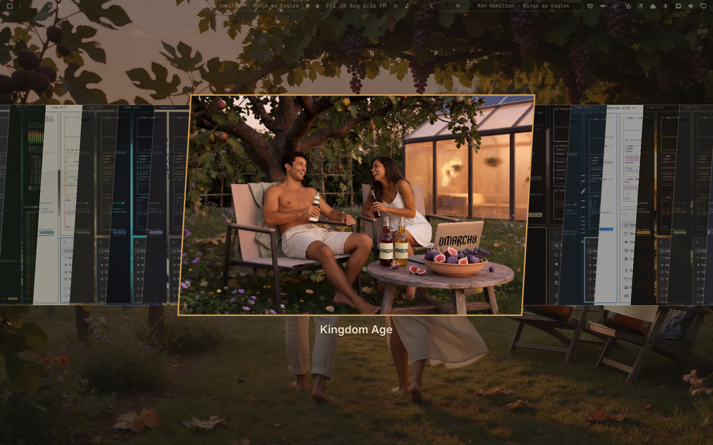

# Kingdom Age

An [Omarchy](https://omarchy.org/) Quattro theme of the biblical Kingdom Age: every household on its own land, under its own vine and fig tree. Golden-hour gardens, quiet solar glass, lawn chairs, and a cold beer. Homemade bottles and the closed laptop wear the Omarchy wordmark.

Micah 4:4 · 1 Kings 4:25 · Zechariah 3:10 · John 1:48–49 · Isaiah 2:4 · Isaiah 65 · Revelation 21–22

Wallpapers generated with Grok Imagine.




## Palette

| Role | Hex | From |
|---|---|---|
| Background | `#17140f` | garden soil at dusk |
| Text | `#ead9c4` | linen |
| Accent | `#d4a054` | honey / beer / lamp |
| Green | `#6f9a4a` | fig leaf |
| Red | `#c45c48` | pomegranate |
| Cyan | `#6aaba0` | river of life |

File icons: Yaru olive. Window borders fade honey → fig leaf.

## Install

From the collection repo root:

```bash
./install-theme.sh kingdom-age
```

Or by hand:

```bash
git clone https://github.com/lukejmorrison/lukesomarchythemes.git
ln -sfn "$PWD/lukesomarchythemes/kingdom-age" ~/.config/omarchy/themes/kingdom-age
omarchy theme set kingdom-age
```

Cycle backgrounds with `Super + Ctrl + Space`.

## Screensaver

Kingdom Age can drive Omarchy’s Matrix screensaver: digital rain in fig-leaf green, then the fig-tree verses resolve on the Omarchy wordmark. A `theme-set` hook copies `screensaver.txt` into `~/.config/omarchy/branding/` when this theme is applied, and restores the stock wordmark when you leave it. Preview with:

```bash
omarchy-launch-screensaver force
```

Any key or mouse movement exits.
